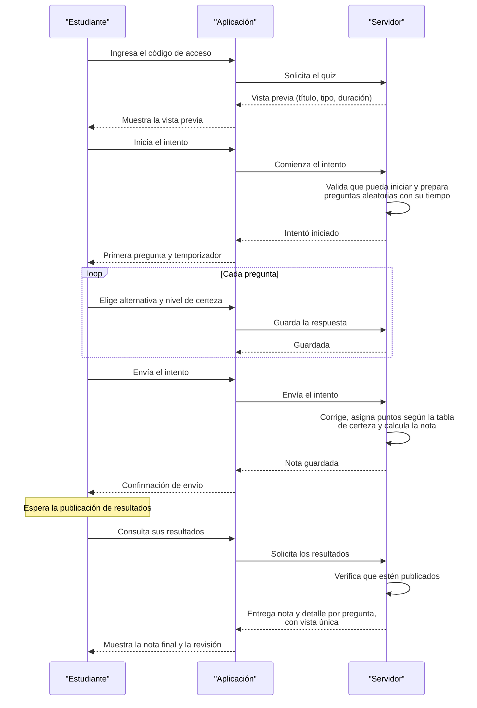
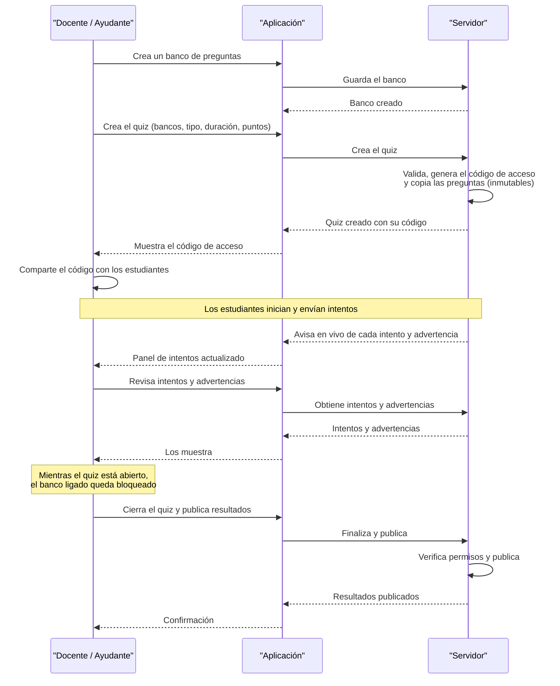

# Diagramas de flujo — Ramtun

Diagramas de secuencia (alto nivel) de los dos flujos principales de la plataforma.
Los bloques Mermaid se renderizan automáticamente en GitHub.

## 1. Flujo Estudiante: entrar a un quiz, enviarlo y ver resultados

## 2. Flujo Docente/Ayudante: crear un quiz, monitorearlo y terminarlo

